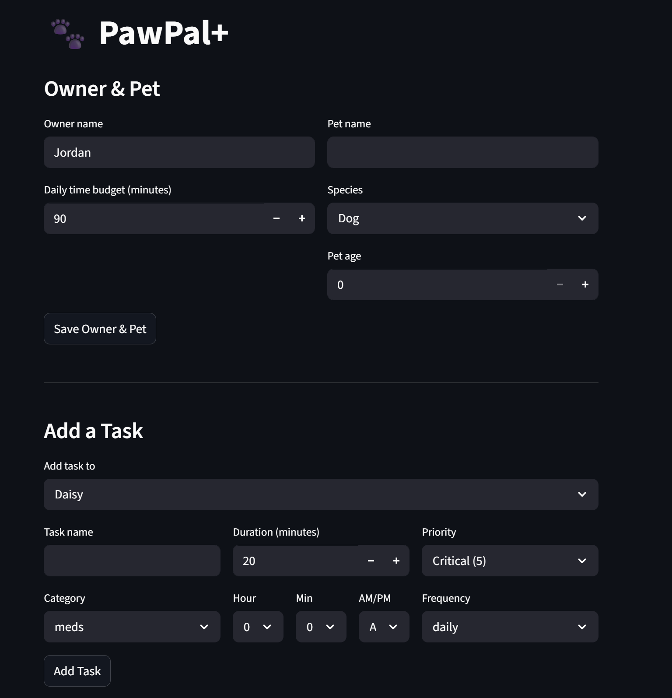
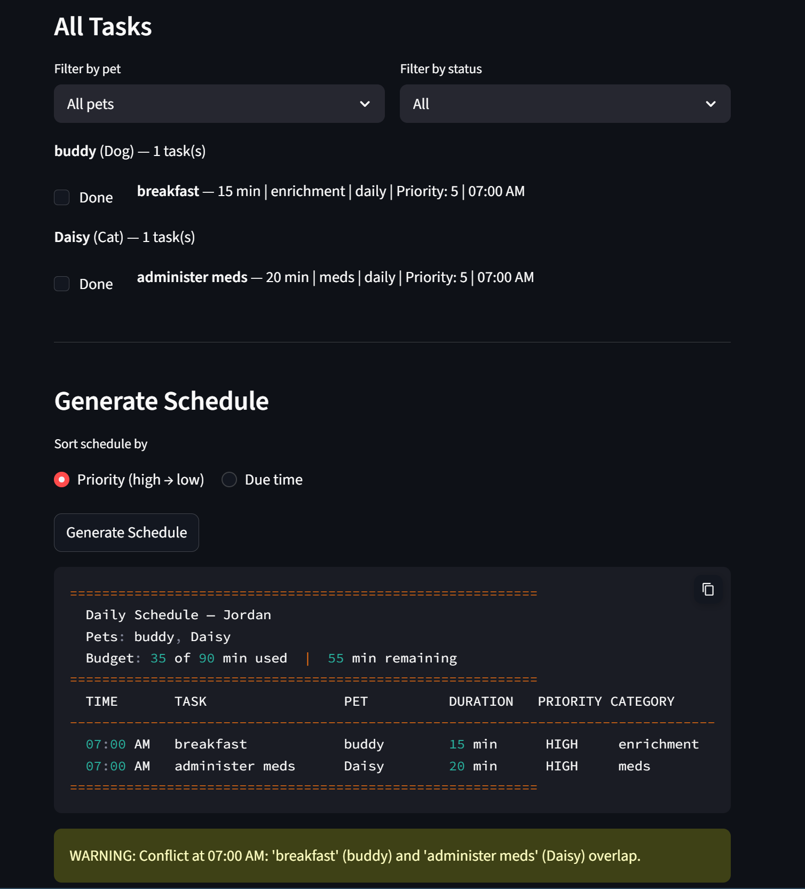

# PawPal+ (Module 2 Project)

You are building **PawPal+**, a Streamlit app that helps a pet owner plan care tasks for their pet.

## Scenario

A busy pet owner needs help staying consistent with pet care. They want an assistant that can:

- Track pet care tasks (walks, feeding, meds, enrichment, grooming, etc.)
- Consider constraints (time available, priority, owner preferences)
- Produce a daily plan and explain why it chose that plan

Your job is to design the system first (UML), then implement the logic in Python, then connect it to the Streamlit UI.

## What you will build

Your final app should:

- Let a user enter basic owner + pet info
- Let a user add/edit tasks (duration + priority at minimum)
- Generate a daily schedule/plan based on constraints and priorities
- Display the plan clearly (and ideally explain the reasoning)
- Include tests for the most important scheduling behaviors

## Getting started

### Setup

```bash
python -m venv .venv
source .venv/bin/activate  # Windows: .venv\Scripts\activate
pip install -r requirements.txt
```

## Smarter Scheduling

PawPal+ goes beyond a basic task list with four algorithmic features built into the `Scheduler` class:

### Priority-first scheduling with gap filling
Tasks are sorted highest to lowest priority and greedily scheduled within the owner's daily time budget. If a high-priority task is too long to fit, the scheduler runs a second pass to fill the remaining time with any skipped tasks that do fit — so no time goes to waste.

### Recurring task renewal
Tasks marked as `daily` or `weekly` automatically renew when completed. Python's `timedelta` calculates the next due date (`today + 1 day` for daily, `today + 7 days` for weekly). The completed instance is replaced with a fresh pending copy at the new date. `as-needed` tasks are one-offs and do not renew.

### Frequency-aware filtering
The scheduler only considers tasks that are actually due. Completed `weekly` and `as-needed` tasks are excluded from scheduling until reset, while `daily` tasks always re-enter the pool each run.

### Conflict detection
`Scheduler.detect_conflicts()` scans the scheduled tasks for any two tasks sharing the same `due_time`. It returns a list of plain-text warning messages rather than raising an exception — the program keeps running and the warnings can be displayed in the terminal or UI.

### UI integration
All scheduling features are exposed in the Streamlit app (`app.py`). After generating a schedule, a **"Sort by"** radio lets the user toggle between:
- **Priority (high → low)** — the default view, showing the full plan with reasoning
- **Due time** — a time-ordered view using `Scheduler.sort_by_time()`

Conflict warnings appear automatically below the schedule as `st.warning()` banners whenever two tasks share the same due time. The backend owns the logic; the frontend only handles display.

---

## Testing PawPal+

### Running the tests

```bash
python -m pytest
```

### What the tests cover

| Area | Tests | Description |
|---|---|---|
| **Sorting correctness** | `test_sort_by_time_*` | Verifies tasks are returned in chronological order — timed tasks sorted earliest-first, untimed tasks appended at the end. |
| **Recurrence logic** | `test_daily_task_renews_*`, `test_weekly_task_renews_*`, `test_as_needed_task_does_not_renew` | Confirms that completing a `daily` task creates a new task for the following day, a `weekly` task renews 7 days out, and `as-needed` tasks do not renew. |
| **Conflict detection** | `test_detect_cross_pet_conflict`, `test_detect_same_pet_conflict`, `test_no_conflict_returns_empty_list` | Verifies that the Scheduler flags duplicate `due_time` values across pets and within the same pet, and returns an empty list when no conflicts exist. |
| **Budget scheduling** | `test_no_tasks_fit_within_budget`, `test_tasks_fill_budget_exactly`, `test_completed_task_excluded_from_schedule` | Checks that the scheduler respects the owner's time budget, fills it exactly when possible, and never includes already-completed tasks. |
| **Core behavior** | `test_mark_complete_changes_status`, `test_add_task_increases_pet_task_count` | Baseline checks that task completion flips the status flag and that pets correctly track added tasks. |

### Confidence Level

**4 / 5 stars**

The suite covers the three critical behaviors (sorting, recurrence, conflict detection) plus budget edge cases and core status logic — giving solid confidence in the scheduling engine. One star is withheld because the tests do not yet cover the Streamlit UI layer (`app.py`) or integration scenarios involving multiple recurrence cycles and overlapping budget+conflict conditions at the same time.

---

### Demo 


<a href="image-2.png" target="_blank"></a>
<a href="image-3.png" target="_blank"></a>

### Suggested workflow

1. Read the scenario carefully and identify requirements and edge cases.
2. Draft a UML diagram (classes, attributes, methods, relationships).
3. Convert UML into Python class stubs (no logic yet).
4. Implement scheduling logic in small increments.
5. Add tests to verify key behaviors.
6. Connect your logic to the Streamlit UI in `app.py`.
7. Refine UML so it matches what you actually built.
