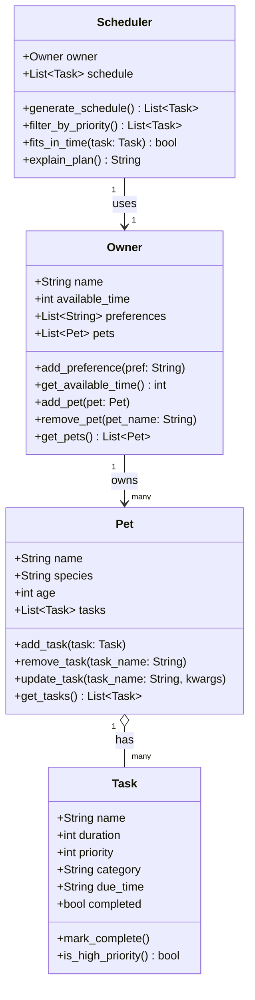

# PawPal+ Project Reflection

## 1. System Design

**a. Initial design**

- Briefly describe your initial UML design.
I have four classes: 
Owner (stores name, time available), 
Pet (stores name, species, tasks list), 
Task (stores name, duration, priority, category), 
Scheduler (takes an owner and pet, applies constraints, and produces an ordered task list)

- What classes did you include, and what responsibilities did you assign to each?
Pet → owns add_task(), remove_task()
Task → holds duration, priority, category
Scheduler → owns the schedule() logic
Owner → holds name, available time, preferences

**c. Class Diagram**

**b. Design changes**

- Did your design change during implementation?
Yes
- If yes, describe at least one change and why you made it.
The most significant change was to `Scheduler`. In my initial design, `Scheduler` took both an `Owner` and a single `Pet` as inputs. During review I realized this contradicted the `Owner` class, which already holds a list of pets. The two classes were out of sync — you could pass a pet the owner didn't even own, and the scheduler would never see any of the owner's other pets. I changed `Scheduler` to accept only an `Owner` and collect tasks from all of the owner's pets internally. This made the relationship consistent: `Owner` → `pets` → `tasks` is now the single path through the system, and the scheduler is no longer bypassing it.
---

## 2. Scheduling Logic and Tradeoffs

**a. Constraints and priorities**

- What constraints does your scheduler consider (for example: time, priority, preferences)?
The scheduler considers three constraints: the owner's daily time budget (total minutes available), task priority (1–5), and task frequency (daily, weekly, as-needed). It also respects completion status — completed tasks are excluded from the next run unless they are daily or weekly, in which case they auto-renew.

- How did you decide which constraints mattered most?
Time budget and priority were the most important because they directly determine what gets done. A task that exceeds the time budget simply can't happen, and priority ensures critical tasks like meds and feeding are scheduled before optional ones like grooming. Frequency came third — it prevents tasks from being double-scheduled or lingering after completion.

**b. Tradeoffs**

- Describe one tradeoff your scheduler makes.
The conflict detector only flags tasks that share the exact same `due_time` string (e.g. both at `"08:30 AM"`). It does not check whether task durations actually overlap — for example, a 30-minute task at `08:00 AM` and a 20-minute task at `08:15 AM` would not be flagged even though they run at the same time.

- Why is that tradeoff reasonable for this scenario?
For a single pet owner managing daily care tasks, exact-time conflicts are the most common and most obvious problem to catch. Implementing full duration-overlap detection would require parsing time strings into `datetime` objects and comparing ranges — significantly more complexity for an edge case that rarely occurs in a home care schedule. The simpler check covers the practical need without overcomplicating the system.

---

## 3. AI Collaboration

**a. How you used AI**

- How did you use AI tools during this project (for example: design brainstorming, debugging, refactoring)?
I used AI throughout the project — starting with design brainstorming to identify which classes and methods I needed, then for debugging when my scheduler wasn't filtering completed tasks correctly, and finally for writing test cases once the logic was working.

- What kinds of prompts or questions were most helpful?
Specific, context-rich prompts worked best. For example, asking "here is my Scheduler class — why would completed tasks still appear in the schedule?" got a direct fix, while vague prompts like "help me with scheduling" led to generic answers I had to reshape.

**b. Judgment and verification**

- Describe one moment where you did not accept an AI suggestion as-is.
When I asked AI to help with conflict detection, it initially suggested raising an exception when a conflict was found. I changed this to returning a list of warning strings instead, so the program would keep running and display warnings in the UI rather than crashing.

- How did you evaluate or verify what the AI suggested?
I ran the suggested code, checked that the behavior matched what I expected, and then wrote a test for it. If the test passed and the UI displayed the warning correctly, I accepted the change.

---

## 4. Testing and Verification

**a. What you tested**

- What behaviors did you test?
I tested sorting correctness (tasks returned in chronological order), recurrence logic (daily/weekly tasks renewing after completion, as-needed tasks not renewing), conflict detection (flagging duplicate due times across and within pets), budget scheduling (tasks excluded when over budget, schedule filling exactly), and core status changes (mark_complete, add_task).

- Why were these tests important?
These are the behaviors users rely on most. If sorting is wrong, the schedule is misleading. If recurrence breaks, tasks silently disappear. If conflicts go undetected, the owner tries to do two things at once. Testing these gave confidence the core logic holds before connecting it to the UI.

**b. Confidence**

- How confident are you that your scheduler works correctly?
4 out of 5. The scheduling engine is well-covered by tests and all 11 tests pass. The main gap is the UI layer — no automated tests exist for the Streamlit app, so visual behavior is only verified manually.

- What edge cases would you test next if you had more time?
Duration-overlap conflicts (two tasks at different times but overlapping durations), multi-cycle recurrence (completing a renewed task and verifying it renews again), and owners with zero available time.

---

## 5. Reflection

**a. What went well**

- What part of this project are you most satisfied with?
The separation between backend logic and the UI. All scheduling decisions live in `pawpal_system.py`, and `app.py` only handles display. This made testing straightforward and the logic easy to reason about independently of Streamlit.

**b. What you would improve**

- If you had another iteration, what would you improve or redesign?
I would improve conflict detection to check duration overlap instead of only exact time matches. I would also add a way to persist tasks between sessions — right now everything resets when the app restarts.

**c. Key takeaway**

- What is one important thing you learned about designing systems or working with AI on this project?
AI is most useful when you already have a clear picture of what you want. The more precisely I described the problem — including what inputs, outputs, and constraints mattered — the more directly useful the AI's response was. Vague questions got vague answers; specific questions got working code.
